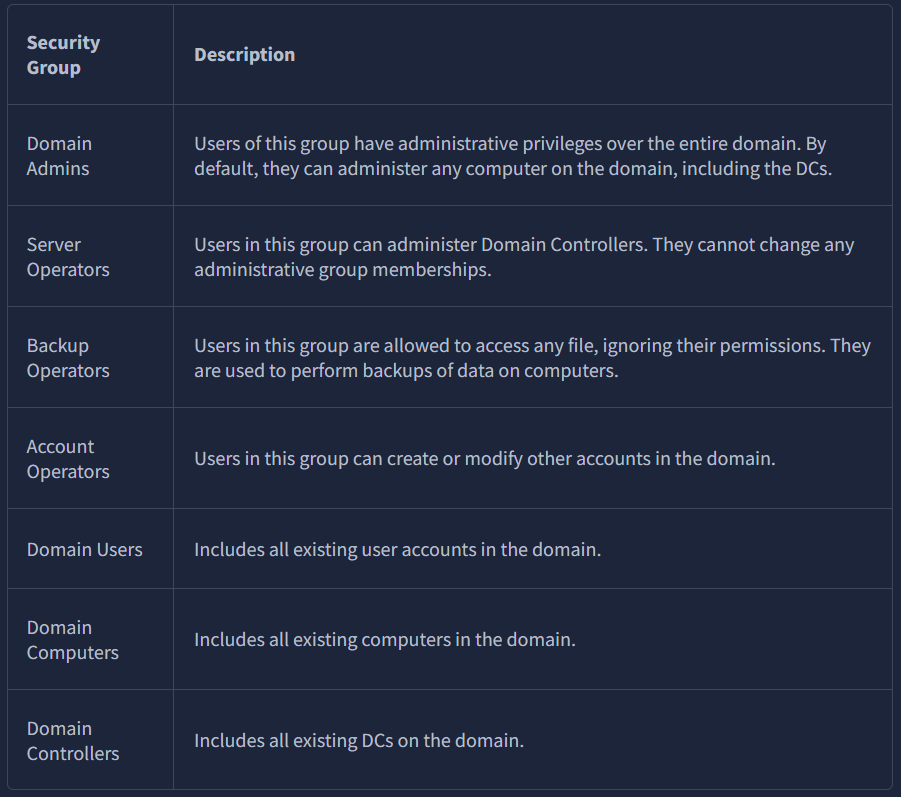
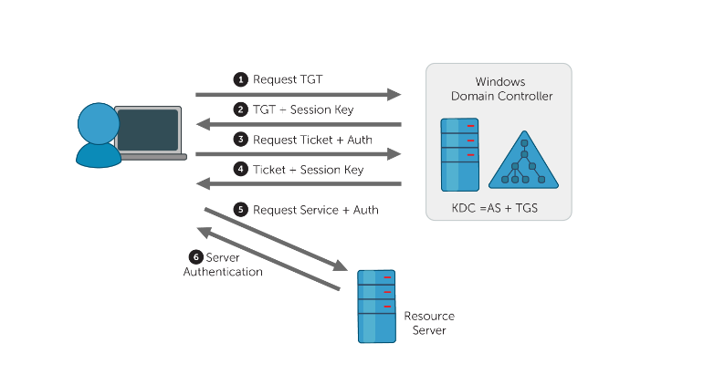
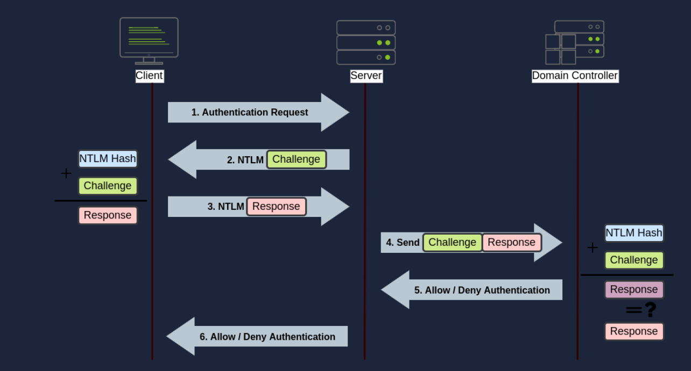

# Windows domain

**Windows domain:** a network under the control of a central authority 
**Active directory (`AD`):** a single repository of the users, computers, and other resources that are part of the domain 
**Domain controller (`DC`):** server that manages the active directory

**Active Directory Domain Service (`AD DS`):** Service the that acts as a central database for the domain

**Machine account:** it's a user account for a computer joined to the domain. 
They possess a password of 120 random caracters and also are local administrator of their computer 
Machine account are always in the same format: `MACHINE_NAME$` 
==> Example: computer's name = PC1 ; machine account = PC1$ 

Most important security groups in Active Directory:

Difference between security groups and organization units (OU):
| **Security Groups**                      | **Organization Units** (`OU`)                 |
|------------------------------------------|-----------------------------------------------|
| Used to grant permission over ressources | Used to apply policies to users and computers |

 
 

**Diagram of an AD architecture**

*There is a DC in each domain*

# User Management in AD

Active Directory is accessible through the `Active Directory Users and Computers` (`ADUC`) console

**Delegation:** the process of granting permissions to users via the OU (like letting an IT staff reset passwords or create user accounts)

# GPO (Group Policy Object)

**GPO:** Policies that are applied to users/computers or entire OU or even the whole domain

to manage GPO, use the `Group Policy Management` service accessible from the windows key

**THE GPO TAKE TIMES TO UPDATE** 
==> To force an update, use the command `gpupdate /force` on the target computer (in powershell)

to share files in a domain, use the `SYSVOL` folder on the DC 
==> this folder is replicated on all DC in the domain

# Authentication methods

## Kerberos

## NTLM (Windows New Technology LAN Manager)

# Concept of trust relationship

A trust relationship is a link between two domains that allows users in one domain to access resources in another domain.

For example, if Domain A trusts Domain B, users in Domain B can access resources in Domain A, but not vice versa. 
==> This is called a **one-way trust**.

A **two-way trust** allows users in both domains to access resources in each other's domains.