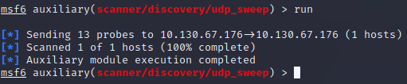
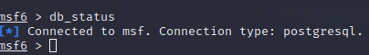

# Metasploit

## Introduction (usage of AI to write this part)

### Concepts
- **Vulnerability** - a design/coding/logic flaw in the target.
- **Exploit** - code that leverages a vulnerability.
- **Payload** - code that actually runs on the target once exploited (shell, command, meterpreter...).

---

### Module types (`modules/` in the Metasploit install)
- **auxiliary** - scanners, fuzzers, crawlers, brute-forcers (supporting modules, not exploits)
- **encoders** - re-encode exploit/payload to dodge signature AV(antivirus) (limited success)
- **evasion** - modules that actively try to evade AV/EDR (Endpoint Detection and Response) detection
- **exploits** - organized by target platform (windows, linux, multi, ...)
- **nops** - no-op padding (0x90 on x86), used to normalize payload size
- **payloads** - `adapters/` (wrap a single payload into another format, e.g. PowerShell), `singles/` (self-contained, e.g. `generic/shell_reverse_tcp` - note the `_`), `stagers/` (open the channel, staged payloads), `stages/` (downloaded by the stager, e.g. `windows/x64/shell/reverse_tcp`)
- **post** - post-exploitation modules, run against an existing session

### Prompts you'll see
- `root@...#` - regular shell, no msf commands
- `msf6 >` - msfconsole, no module context yet
- `msf6 exploit(path/to/module) >` - module context (also `auxiliary(...)`, `post(...)`)
- `meterpreter >` - interacting with a Meterpreter session
- `C:\...>` / `$` - a plain shell on the target itself

---

### Core commands

#### Navigation / search
- `search <term>` - find modules (by name, CVE, platform, type...)
  - `search cve:2021 type:exploit platform:windows`
  - `search name:eternalblue`
- `use <path or #>` - load a module (path, or index number from last `search`)
- `back` - leave the current module context
- `info` - details on the currently loaded module (or `info <module>` without loading it)

#### Module usage
- `show options` - required/optional params for current module
- `show payloads` - compatible payloads for current exploit
- `show targets` - target list (OS/version variants) for current exploit
- `show advanced` - advanced options
- `set <OPTION> <value>` - set a param, current module context only (e.g. `set RHOSTS`, `set LHOST`)
- `setg <OPTION> <value>` - set globally, persists across module switches (`unsetg` to clear)
- `unset <OPTION>` / `unset all` - clear one or all params in current context
- `set PAYLOAD <payload>` - pick a payload manually (index from `show payloads` also works)
- `check` - test if target is vulnerable without exploiting (not all modules support it)
- `run` / `exploit` - launch the module (both work; `run` also makes sense for non-exploit modules)
- `exploit -z` - launch and immediately background the resulting session

Common params: `RHOSTS` (target), `RPORT` (target port), `LHOST`/`LPORT` (your listener), `PAYLOAD`, `SESSION` (id to target with post modules).

#### Sessions / jobs
- `sessions` - list active sessions
- `sessions -i <id>` - interact with a session
- `background` (or Ctrl+Z) - background current session
- `jobs`, `jobs -k <id>` - list/kill background jobs

#### General environment
- `help` / `<command> -h` - command help
- `history` - command history
- `db_status` - check database connection (for search/workspace speed)
- `workspace`, `workspace -a <name>` - manage workspaces (project separation)
- `hosts`, `services`, `vulns` - query the database from prior scans
- `exit` / `quit` - leave msfconsole

---

## Exploitation

### Workflow
1. Search for a module (e.g. `search cve:2021 type:exploit platform:windows`)
2. Load the module using the command `use <path or #>`
3. set the required options for the module using the `set` command
4. Run the module using the `run` or `exploit` command

**Example of a launched exploit**



---

### Scanning

Useful auxiliary modules for scanning and enumeration:
- `auxiliary/scanner/portscan/tcp` - TCP port scanner
- `auxiliary/scanner/portscan/udp` - UDP port scanner
- `auxiliary/scanner/discovery/udp_sweep` - UDP sweep scanner
- `auxiliary/scanner/smb/smb_version` - SMB version detection
- `auxiliary/scanner/smb/smb_enumshares` - enumerate SMB shares

---

### Database

#### Configuration
```bash
root@attackbox:~# systemctl start postgresql 
root@attackbox:~# sudo -u postgres msfdb init
Running the 'init' command for the database:
Creating database at /var/lib/postgresql/.msf4/db
Creating db socket file at /tmp
Starting database at /var/lib/postgresql/.msf4/db...waiting for server to start.... done
server started
success
Creating database users
Writing client authentication configuration file /var/lib/postgresql/.msf4/db/pg_hba.conf
Stopping database at /var/lib/postgresql/.msf4/db
Starting database at /var/lib/postgresql/.msf4/db...waiting for server to start.... done
server started
success
Creating initial database schema
Database initialization successful
root@attackbox:~#
```

*You should get a similar output as shown above if the configuration is correct.*

---

#### Workspace
you can create workspaces to separate projects using the command `workspace`

```bash
workspace -h
Usage:
    workspace          List workspaces
    workspace [name]   Switch workspace

OPTIONS:

    -a, --add <name>          Add a workspace.
    -d, --delete <name>       Delete a workspace.
    -D, --delete-all          Delete all workspaces.
    -h, --help                Help banner.
    -l, --list                List workspaces.
    -r, --rename <old> <new>  Rename a workspace.
    -S, --search <name>       Search for a workspace.
    -v, --list-verbose        List workspaces verbosely.
```

---

#### Database commands
```bash
Command           Description
-------           -----------
analyze           Analyze database information about a specific address or address range
db_connect        Connect to an existing data service
db_disconnect     Disconnect from the current data service
db_export         Export a file containing the contents of the database
db_import         Import a scan result file (filetype will be auto-detected)
db_nmap           Executes nmap and records the output automatically
db_rebuild_cache  Rebuilds the database-stored module cache (deprecated)
db_remove         Remove the saved data service entry
db_save           Save the current data service connection as the default to reconnect on startup
db_status         Show the current data service status
hosts             List all hosts in the database
loot              List all loot in the database
notes             List all notes in the database
services          List all services in the database
vulns             List all vulnerabilities in the database
workspace         Switch between database workspaces
```

you can use `Command -h` to get more information about each command.

---

### Session management
- `sessions` - list active sessions
- `sessions -i <id>` - interact with a session
- `sessions -u <id>` - upgrade a shell to a Meterpreter session
- `sessions -k <id>` - kill a session

## Msfvenom

