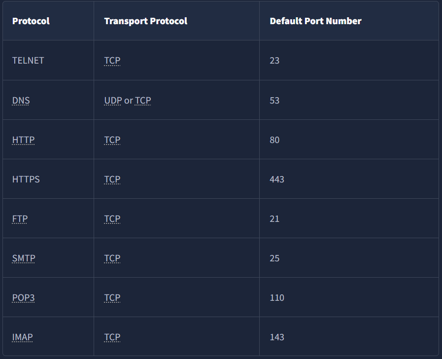

# Networking via CLI

## HTTP(s)

syntax: `telnet [options] host port`
explantion: `telnet` is a simple command-line tool to connect to a specified host and port. It can be used to test connectivity to a server or service.

To do a GET request to a HTTP server, you can do:

```
telnet IP_ADDRESS 80 (or 443 for HTTPS)
GET /file.txt HTTP/1.1
Host: anything

response...
```

## ftp

syntax: `ftp [options] host`
explantion: `ftp` is a command-line tool to transfer files to and from a remote server using the File Transfer Protocol (FTP). It allows you to upload, download, and manage files on the server.

To connect to an FTP server and download a file, you can use:

```
ftp IP_ADDRESS
ls
get file.txt
quit
```

## SMTP

use `telnet` to connect to an SMTP server and send an email.

```
telnet smtp.example.com 25
HELO yourdomain.com
MAIL FROM:<example@mail.com>
RCPT TO:<receiver@mail.com>
DATA
Subject: Test Email
This is a test email.
.
QUIT
```

HELO initiate the SMTP session
MAIL FROM specify the sender's email address
RCPT TO specify the recipient's email address
DATA indicates the start of the email content, ending with a single period (.) on a line by itself

## POP3

- `USER` <username> identifies the user
- `PASS` <password> provides the user’s password
- `STAT` requests the number of messages and total size
- `LIST` lists all messages and their sizes
- `RETR` <message_number> retrieves the specified message
- `DELE` <message_number> marks a message for deletion
- `QUIT` ends the POP3 session applying changes, such as deletions

```
telnet pop.example.com 110
USER yourusername
PASS yourpassword
STAT
LIST
RETR 1
DELE 1
QUIT
```

## IMAP

- `LOGIN` <username> <password> authenticates the user
- `SELECT` <mailbox> selects a mailbox (e.g., INBOX)
- `FETCH` <message_set> <data_item> retrieves specific messages or parts of messages
- `MOVE` <message_set> <mailbox> moves messages to a different mailbox
- `COPY` <message_set> <mailbox> copies messages to a different mailbox
- `LOGOUT` ends the IMAP session

```
telnet imap.example.com 143
LOGIN yourusername yourpassword
SELECT INBOX
FETCH 1 BODY[]
LOGOUT
```

# PORTS

