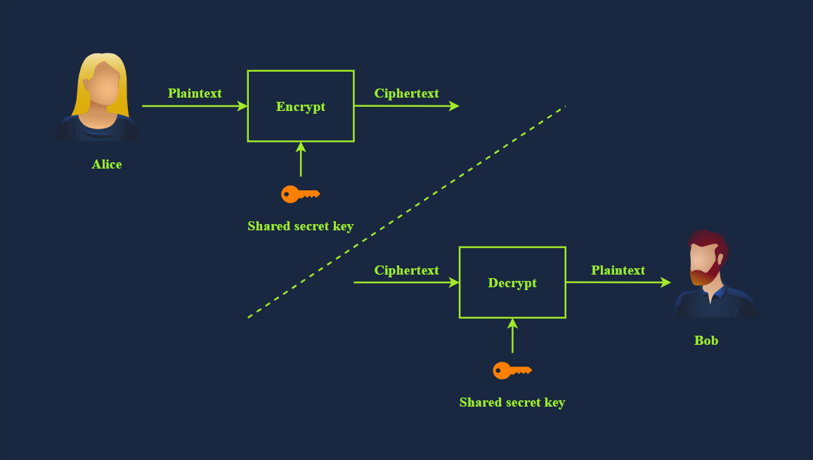
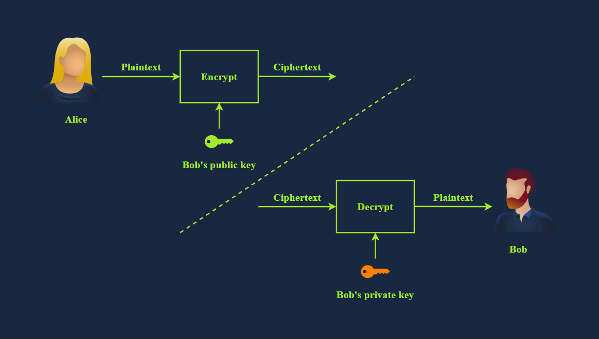

# Basics of Encryption

## Symmetric Encryption



## Asymmetric Encryption



# RSA Algorithm

## Key Generation
1. Choose two distinct prime numbers `p` and `q`.
2. Compute `n = p * q`.
3. Compute the totient: `φ(n) = (p-1)(q-1)`.
4. Choose an integer `e` such that `1 < e < φ(n)` and `gcd(e, φ(n)) = 1`.<br>
    - To choose `e`, you need it to be a prime number that does not divide `φ(n)`.<br>
    - `gcd` is the greatest common divisor.
5. Compute `d` as the modular multiplicative inverse of `e mod φ(n)`.<br>
    - `d = e^(-1) mod φ(n)`   

The public key is `(e, n)` and the private key is `(d, n)`.

<u>example:</u>

- `p = 61`, `q = 53`
- `n = 61 * 53 = 3233`
- `φ(n) = (61-1)(53-1) = 3120`
- Choose `e = 17` (since `gcd(17, 3120) = 1`)
- Compute `d` such that `d * 17 ≡ 1 (mod 3120)` → `d = 2753`
- Public key: `(17, 3233)`, Private key: `(2753, 3233)`

# Diffie-Hellman key exchange


# SSH Key

## Generate SSH Key Pair

```bash
ssh-keygen -t rsa
```

## Access SSH keys on your system

```bash
ls -al ~/.ssh
```

# GPG Key

**GPG (GNU Privacy Guard) is a free open source encryption software that uses the OpenPGP standard for encrypting and signing data and communications.** 

## Generate GPG Key Pair

```bash
gpg --full-generate-key
```

## Access GPG keys on your system

```bash
gpg --list-keys
```

## Import a GPG Key

```bash
gpg --import <keyfile>
```
Encrpy a file using GPG

```bash
gpg -encrypt <file>
```

## Decrypt a file using GPG

```bash
gpg -decrypt <file>.gpg
```

## List GPG Keys

```bash
gpg --list-keys # public keys
gpg --list-secret-keys # private keys
```