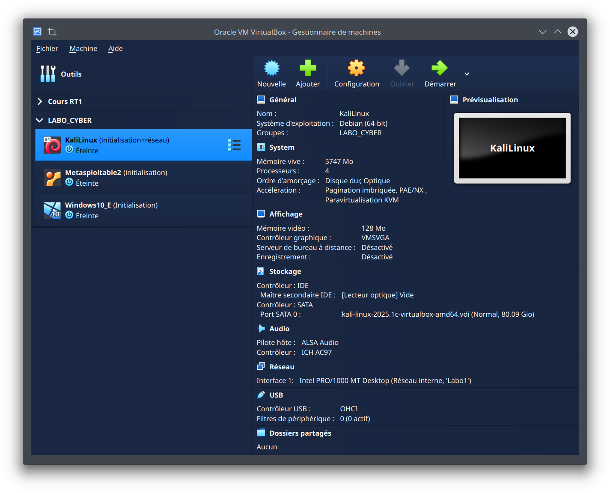

# Tuto de création du Labo Cyber

## <span style="color:red;">Prérequis</span>

Tout d'abord, il y a ces installations à faire :

- Avoir VirtualBox
- Avoir une Machine Virtuelle Kali Linux [Installation Kali](https://cdimage.kali.org/kali-2025.1c/kali-linux-2025.1c-virtualbox-amd64.7z)
- Avoir une Machine Virtuelle Metasploitable2 [Installation Metasploitable2](https://sourceforge.net/projects/metasploitable2/)
- 
**Pour Installer VirtualBox :**
Il faut avoir installé le fichier **install_virtualbox.sh** et lancer ces commandes dans le même répertoire (où se trouve le fichier d'installation).
*Choisir le fichier d'installation correspondant à son OS*

```
sudo chmod +x install_virtualbox.sh
sudo bash install_virtualbox.sh 
```

## <span style="color:red;">Mise en place et Configuration</span>

### 1. Importer les VM dans VirtualBox

- Ouvre **VirtualBox**.  
- Pour Kali Linux et Metasploitable2 :  
  - Clique sur **Machine > Ajouter**.  
  - Navigue vers le dossier où tu as téléchargé ou extrait la VM (**.ova**, **.vbox** ou **.vdi**).  
  - Sélectionne la VM et valide pour l’importer.

---

### 2. Configurer le réseau interne dans VirtualBox

- Dans les paramètres de chaque VM (**Kali**, **Metasploitable2**) :
  Onglet **Réseau** > Activer la carte réseau 1 > Mode Réseau : **Réseau interne** > Nom : **Labo1**.
- Cette configuration isole les VM dans un réseau privé accessible uniquement par elles.

---

### 3. Configurer les VM

#### 3.1. Se connecter aux Machines Virtuelles

Pour configurer les IP statiques, il faut d'abord se connecter à chaque machine virtuelle (Kali Linux et Metasploitable2). Voici comment procéder pour chaque VM :
*Chaque VM est par défaut en qwerty faire ceci pour repasser en AZERTY :*
```bash
sudo loadkeys fr
```


##### Pour **Kali Linux** :

1. Lance ta VM Kali Linux dans **VirtualBox**.
2. Lorsque Kali Linux démarre, tu devrais être invité à entrer un nom d'utilisateur et un mot de passe.
   * **Nom d'utilisateur** : `kali`
   * **Mot de passe** : `kali`

   Si tu as modifié ces identifiants, entre ceux que tu as définis lors de l'installation de la VM.
3. Une fois connecté, tu seras dans le terminal de Kali Linux.

##### Pour **Metasploitable2** :

1. Lance ta VM Metasploitable2 dans **VirtualBox**.
2. Lorsque Metasploitable2 démarre, tu devrais voir un écran de connexion avec les identifiants suivants :
   * **Nom d'utilisateur** : `msfadmin`
   * **Mot de passe** : `msfadmin`

3. Après t'être connecté, tu seras dans le terminal de Metasploitable2.

---

#### 3.2. Configurer les adresses IP

Maintenant que l'on a accès aux deux Machines Virtuelles, il suffit juste à les configurer pour qu'elles puissent communiquer entre-elles :

##### Pour **Kali Linux** :

1. **Ouvre un terminal** dans Kali Linux.

2. Pour configurer l'IP statique, Kali utilise **Network Manager**, qui peut être configuré via l'interface graphique ou en ligne de commande.

   ##### En ligne de commande :
   
   Utilise `nmcli` pour modifier les paramètres réseau :

   - Liste les connexions réseau disponibles :
   
     ```bash
     nmcli con show
     ```

   - Trouve le nom de ta connexion réseau (généralement quelque chose comme `Wired connection 1` ou `eth0`).

   - Modifie la configuration de cette connexion pour attribuer une adresse IP statique :
   
     ```bash
     sudo nmcli con mod "Wired connection 1" ipv4.addresses 10.0.10.1/24 ipv4.gateway 10.0.10.254 ipv4.method manual
     ```

     Ce commandement attribue :
     - **Adresse IP statique** : `10.0.10.1`
     - **Passerelle** : `10.0.10.254`

   - Redémarre la connexion réseau pour appliquer les changements :
   
     ```bash
     sudo nmcli con down "Wired connection 1" && sudo nmcli con up "Wired connection 1"
     ```

   ##### Interface graphique :
   
   Si tu préfères l'interface graphique :
   - Clique sur l'icône **Network Manager** dans la barre d'état système.
   - Sélectionne **Edit Connections**.
   - Choisis ta connexion, puis clique sur **Modifier**.
   - Dans l'onglet **IPv4 Settings**, sélectionne **Manual** dans le menu déroulant **Method**, puis ajoute l'adresse IP (`10.0.10.1`) et la passerelle (`10.0.10.254`)
   - Sauvegarde et redémarre la connexion.

3. Vérifie que l'IP statique est bien attribuée en utilisant la commande `ip a` ou `ifconfig`.

---

##### Pour **Metasploitable2** :

1. **Ouvre un terminal** dans Metasploitable2.

2. Modifie le fichier de configuration réseau pour attribuer une adresse IP statique à l'interface réseau.

   * Ouvre le fichier `/etc/network/interfaces` en tant que superutilisateur :
   
   ```bash
   sudo nano /etc/network/interfaces
   ```

3. Modifie la configuration de l'interface réseau eth0 pour lui attribuer une adresse IP statique.

Exemple de configuration :

```bash
auto eth0
iface eth0 inet static
    address 10.0.10.2
    netmask 255.255.255.0
    gateway 10.0.10.254
```
4. **Sauvegarde** et **ferme** le fichier (`Ctrl + Y`, puis Enter pour sauvegarder, et `Ctrl + X` pour fermer nano).

5. Redémarre la machine

```bash
sudo reboot
```

1. Vérifie la configuration en utilisant la commande `ip a` pour t'assurer que l'IP statique est bien attribuée à l'interface `eth0`.

--- 

### 3.3 Tester la connectivité entre les VM

Une fois que les IP statiques sont configurées sur les trois VM, tu peux tester la connectivité entre elles en utilisant la commande `ping` :

---

#### Depuis **Kali Linux** :

- Ping Metasploitable2 :

```bash
ping 10.0.10.2
```

Si la connectivité est établie avec succès, les deux machines peuvent communiquer via le réseau privé que tu as configuré.

## <span style="color:red;">Résultats attendus</span>

### Sur VirtualBox :
<div align="center"> 
<i>Figure 1 : Vue de VirtualBox avec les 2 VM</i></div>